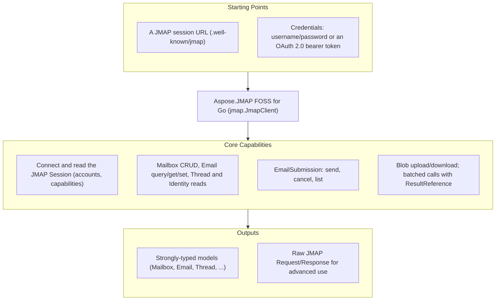

# Aspose.JMAP FOSS for Go

[](LICENSE) [](https://pkg.go.dev/github.com/aspose-email-foss/Aspose.JMAP-FOSS-for-Go) [](https://github.com/aspose-email-foss/Aspose.JMAP-FOSS-for-Go/graphs/contributors)

Aspose.JMAP FOSS for Go is a free, open source JMAP client library for Go — a package for
talking to a [JMAP](https://jmap.io) mail server over HTTP:
[RFC 8620](https://www.rfc-editor.org/rfc/rfc8620) Core (session, `Core/echo`, blob
upload/download, batched method calls) and [RFC 8621](https://www.rfc-editor.org/rfc/rfc8621)
Mail (Mailbox/Email/Thread/Identity/SearchSnippet) plus EmailSubmission. Its public API is
styled after Aspose.Email's client conventions — a client value plus an options struct, a
`Connect` call that returns the session, and strongly-typed message and folder models — and it
depends only on the Go standard library.

**This is an official Aspose open-source project. It does not contain or reference Aspose.Email
proprietary source.** The library is generated from hand-authored JMAP protocol specifications.

## Navigation

- [At a Glance](#at-a-glance)
- [Key Capabilities](#key-capabilities)
- [Installation](#installation)
- [Dependencies](#dependencies)
- [Quick Start](#quick-start)
- [Additional Examples](#additional-examples)
- [API Reference](#api-reference)
- [Documentation & Resources](#documentation--resources)
- [Scope and Limitations](#scope-and-limitations)
- [Development and Testing](#development-and-testing)
- [License](#license)

## At a Glance



## Key Capabilities

- **Connect and inspect the session** — `client.Connect()` fetches `/.well-known/jmap` and
  returns the `Session` (account ids, `Capabilities`, `ApiURL`, `UploadURL`, `DownloadURL`).
- **Mailboxes** — `ListMailboxes()`, `GetMailbox()`, `CreateMailbox()`, `DeleteMailbox()` wrap
  `Mailbox/get`, `Mailbox/query`, and `Mailbox/set`.
- **Messages** — `ListMessages()`, `FetchMessage()`, `MoveMessage()`, `SetMessageKeyword()`,
  `DeleteMessage()` over `Email/query`, `Email/get`, and `Email/set`.
- **Identities** — `ListIdentities()` over `Identity/get`.
- **Sending** — `Send()`, `CancelSend()`, `ListSubmissions()` wrap `EmailSubmission/set` and
  `EmailSubmission/get`.
- **Blobs** — `UploadBlob()` / `DownloadBlob()` for `/upload` and `/download`.
- **Batching** — `SendRequest()` sends any slice of `Invocation`s in one HTTP round trip, with
  `ResultReference` ([RFC 8620 §3.7](https://www.rfc-editor.org/rfc/rfc8620#section-3.7)) to
  chain one call's result into the next.
- **Pluggable transport** — the client takes a `Transport` interface; every unit test supplies a
  fake, so no test needs a network.
- **OAuth 2.0** — a `BearerToken` option ([RFC 6750](https://www.rfc-editor.org/rfc/rfc6750)) as
  an alternative to HTTP Basic.

## Installation

The module path is `github.com/aspose-email-foss/Aspose.JMAP-FOSS-for-Go` (imported as package `jmap`). No versioned tag
has been published yet; until one is, vendor the repository or point a `replace` directive at a
local checkout (see [Development and Testing](#development-and-testing)).

```bash
go get github.com/aspose-email-foss/Aspose.JMAP-FOSS-for-Go
```

## Dependencies

### Required Package Dependencies

None. `go.mod` declares no `require`d modules — JSON and HTTP come from the standard library.

### Native and System Requirements

- Go 1.21 or later.

### Development Dependencies

- None beyond the Go toolchain; tests use the standard `testing` package.

## Quick Start

```go
import "github.com/aspose-email-foss/Aspose.JMAP-FOSS-for-Go"

options := jmap.ClientOptions{
    SessionURL: "https://jmap.example.test/.well-known/jmap",
    Username:   "user@example.test",
    Password:   "secret",
}
client := jmap.NewClient(options)
session, err := client.Connect()
```

## Additional Examples

### OAuth 2.0 bearer token authentication

Authenticate with an OAuth 2.0 bearer token
([RFC 6750](https://www.rfc-editor.org/rfc/rfc6750)) by setting `BearerToken`; when non-empty it
takes precedence over Basic authentication:

```go
options := jmap.ClientOptions{
    SessionURL:  "https://jmap.example.test/.well-known/jmap",
    BearerToken: "oauth-access-token",
}
client := jmap.NewClient(options)
session, err := client.Connect()
```

<details>
<summary>Batching requests with ResultReference</summary>

Multiple method calls can be batched into a single HTTP round trip via `SendRequest`, using a
`ResultReference` ([RFC 8620 §3.7](https://www.rfc-editor.org/rfc/rfc8620#section-3.7)) to chain
a later call to an earlier one's result without a second request:

```go
query := jmap.Invocation{Name: "Email/query", Arguments: map[string]interface{}{"accountId": accountId}, MethodCallId: "c1"}
get := jmap.Invocation{
    Name: "Email/get",
    Arguments: map[string]interface{}{
        "accountId": accountId,
        "#ids":      jmap.ResultReference{ResultOf: "c1", Name: "Email/query", Path: "/ids"},
    },
    MethodCallId: "c2",
}
resp, err := client.SendRequest([]jmap.Invocation{query, get}, []string{"urn:ietf:params:jmap:mail"})
```

</details>

## API Reference

`jmap.NewClient` / `jmap.ClientOptions` is the single entry point; the model types `Session`,
`Mailbox`, `Email`, `EmailAddress`, `Thread`, `Identity`, `EmailSubmission`, and `SearchSnippet`
mirror the JMAP objects one-to-one, and `Invocation` / `ResultReference` model raw method calls
for `SendRequest`. Errors surface as `JmapNetworkError` (transport) and `JmapProtocolError` (a
JMAP method-level error); per-item `Set` failures are returned as data on the result value
rather than as an `error`.

The protocol/API reference is generated from the same specifications that drive this library.

## Documentation & Resources

- Found a bug or have a feature request? [Open an issue](https://github.com/aspose-email-foss/Aspose.JMAP-FOSS-for-Go/issues) on GitHub.

## Scope and Limitations

- **Protocol**: JMAP Core (RFC 8620) and JMAP Mail (RFC 8621: Mailbox/Email/Thread/Identity/SearchSnippet)
  plus EmailSubmission.
- **Out of scope for v1**:
  - Push / `EventSource` streaming — the type exists but is a stub/no-op.
  - JMAP for Calendars and Contacts.
  - `Date`/`UTCDate` values are kept as raw RFC 3339 strings (no `time.Time` parsing) to avoid
    timezone-conversion bugs.
- Unit tests run against a fake `Transport` with mocked responses — no live JMAP server is
  required. A Docker-based live-server integration suite (Stalwart Mail Server) lives in
  a separate Docker-based live-server suite used during release validation.

## Development and Testing

```bash
git clone https://github.com/aspose-email-foss/Aspose.JMAP-FOSS-for-Go.git
cd Aspose.JMAP-FOSS-for-Go
go build ./...
go test ./...
```

Live-server integration testing is maintained separately from this distribution repository.

## License

This project is licensed under the [MIT License](LICENSE). The MIT License permits use, copying,
modification, distribution, sublicensing, and commercial use, provided its copyright and
permission notice are retained. The software is provided without warranty.
